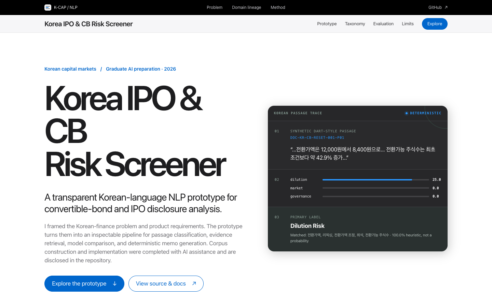

# Korea IPO & CB Risk Screener

> A transparent Korean-language NLP prototype for convertible-bond and IPO disclosure analysis.

[Live demo](https://lewis-kim-applicant.vercel.app/) · [Public source snapshot](https://github.com/LewisKim7/Korea-IPO-CB-Risk-Screener)

| Applicant context | Detail |
| --- | --- |
| Created and directed by | **Yoochan Kim (Lewis Kim · 김유찬)** |
| Professional context | Finance and deep-tech investment professional |
| Application context | Graduate study in artificial intelligence and data science at The University of Texas at Austin |
| Applicant direction | Korean capital-markets problem framing, risk taxonomy, product requirements, and evaluation questions |
| Applicant profile | [Background and selected work](https://personal-sns-beta.vercel.app/) |
| Public role evidence | [FSS DART filing: fund manager for the Hanwha IPO Plus fund, 26 Aug 2025](https://dart.fss.or.kr/dsaf001/main.do?rcpNo=20250826000004&dcmNo=10784143&keyword=%EA%B9%80%EC%9C%A0%EC%B0%AC) (Korean) |

This is optional supporting evidence for an application, not an official UT Austin
submission or a required application item. It is not affiliated with or endorsed by
The University of Texas at Austin.



Korea IPO & CB Risk Screener is an independent educational project created by Yoochan Kim (Lewis Kim · 김유찬) while preparing applications for graduate study in artificial intelligence and data science. It connects Korean capital-markets workflows with structured screening, Korean passage classification, lexical evidence retrieval, a trained text baseline, explicit evaluation, and deterministic memo generation.

The interface is English so an international reviewer can follow the methodology. The disclosure-style source passages are Korean because Korean-language processing is the substantive problem being explored.

The market overview uses a dated, read-only snapshot of real public results from the applicant's two deployed tools. The five-document NLP corpus remains wholly synthetic. Real issuers are never inserted into the corpus or assigned a risk label.

> **AI-assisted development disclosure:** Yoochan Kim defined the domain problem, project objective, risk taxonomy, feature requirements, evaluation questions, and application purpose. Codex assisted with synthetic-data drafting, implementation, documentation, and automated verification. All reference labels and rationales were drafted within the same AI-assisted project and have not been independently annotated or adjudicated. The reported results are development diagnostics, not independently validated performance.

## Reviewer fast path

| Time | Suggested path |
| --- | --- |
| 90 seconds | Open the [live demo](https://lewis-kim-applicant.vercel.app/), inspect the frozen real-market overview, select a synthetic document, run a Korean query, and compare the per-label recall traces in Evaluation. |
| 5 minutes | Read the research question, document-held-out protocol, exact ML errors, retrieval diagnostic, and limitations on this page. |
| Reproduce | Run `npm ci && npm run verify`; no API key, backend, network model, or private dataset is required. |

Yoochan Kim contributed the Korean capital-markets framing, product objective, risk taxonomy, feature requirements, evaluation questions, interpretation, and intended graduate-study narrative. AI assistance in corpus drafting, implementation, documentation, and QA is disclosed rather than presented as solo engineering work.

## At a glance

| Item | Implementation |
| --- | --- |
| Application | React, TypeScript, and Vite |
| Source language | Korean passages; English interface |
| Corpus | 5 fictional KOSPI/KOSDAQ documents |
| Evaluation set | 30 synthetic passages across 7 labels |
| Transparent baseline | Korean/English weighted phrase rules |
| Trained baseline | Unigram TF-IDF + multinomial logistic regression |
| ML protocol | 5-fold leave-one-document-out; 24 train / 6 test per fold |
| Retrieval | TF-IDF cosine lexical ranking |
| Retrieval diagnostic | 12 AI-assisted Korean queries; graded relevance; Precision@3, Recall@3, MRR@3, nDCG@3 |
| Memo | Deterministic template with passage-ID citations |
| Visual diagnostics | Frozen real-market CB/IPO snapshots and per-label baseline recall |
| Runtime boundary | Core NLP needs no API key, remote model, or backend; source-tool embeds are optional |

## Research question

Korean convertible-bond issuance decisions and IPO prospectuses contain structured terms, but their implications are distributed across tables and dense Korean text. A first-pass analyst must connect terms such as conversion-price resets, put and call options, use of proceeds, lockups, related-party relationships, cash runway, and execution milestones to the passages that support a risk assessment.

This project asks:

> Can a transparent Korean-language NLP workflow connect structured IPO and CB screening with passage-level risk triage while keeping every conclusion linked to inspectable evidence?

The objective is not automated investment judgment. It is to make the problem formulation, data, rules, learned baseline, evidence trail, errors, and limitations visible.

## Production-tool evidence layer

The compact market overview preserves selected public facts from two workflows already present in the applicant's portfolio:

- [CB Zero Finder](https://cb-zero-finder.vercel.app/) — a strict numeric `0.0%` coupon and `0.0%` maturity-yield screen captured on 11 Aug 2026.
- [IPO Market Report](https://ipo-market-report.vercel.app/) — selected aggregate and return facts from its public PDF, using data through 7 Aug 2026 and generated on 8 Aug 2026.

The linked applications are embedded as source-tool views and may update independently. The portfolio's summarized evidence is deliberately frozen, so admissions reviewers see a reproducible dated snapshot rather than a moving result. No private workbook, API key, full copyrighted filing, or private dataset was imported. The real structured facts are display evidence only: they are strictly separated from the synthetic NLP corpus and receive no model prediction, risk label, or investment recommendation.

### Frozen public-market snapshot

| Workflow | Source date | Frozen result |
| --- | --- | --- |
| IPO scope | Data through 7 Aug 2026; PDF generated 8 Aug 2026 | 52 firms; 19.5 trillion KRW total offer market capitalization |
| IPO returns | Same public report snapshot | +111.4% average first-day return; −5.1% average current return; 36 of 52 below offer price |
| CB scope | Captured 11 Aug 2026, covering 14 May–11 Aug 2026 | 118 filing rows |
| Strict CB zero screen | Same capture | 41 rows across 40 issuers; 17,898.6억원 total principal |

For the CB screen, only numeric zero in both rate fields qualifies; a `-` placeholder is treated as missing and excluded. The five largest qualifying rows are Hyundai Engineering & Construction (5,000억원), LigaChem Biosciences (1,700억원), Sungho Electronics (1,000억원), TSE (1,000억원), and Won Tech (750억원). Company names and values are source observations, not automatically refreshed portfolio data.

The frozen source artifacts are integrity-pinned in `src/data/market-snapshot.ts` with the public IPO PDF and CB API-response SHA-256 values captured during the 11 Aug 2026 validation pass.

## Synthetic Korean corpus

The corpus contains two convertible-bond documents and three IPO documents. Every issuer, identifier, date, transaction, amount, and passage is fictional.

| Document ID | Fictional issuer | Market | Document type | Passages |
| --- | --- | --- | --- | ---: |
| `DOC-KR-CB-ISSUE-001` | Hanbit Quantum Motion | KOSDAQ | DART-style CB Issuance Decision | 6 |
| `DOC-KR-CB-RESET-001` | Serim Neurochip | KOSDAQ | DART-style CB Terms Amendment | 6 |
| `DOC-KR-IPO-PROSPECTUS-001` | Gaon BioCompute | KOSDAQ | KOSDAQ IPO Prospectus Excerpt | 6 |
| `DOC-KR-IPO-PROCEEDS-001` | Daon GreenCell | KOSPI | KOSPI IPO Use-of-Proceeds Excerpt | 6 |
| `DOC-KR-IPO-RISK-001` | Mir Orbital Link | KOSDAQ | KOSDAQ IPO Risk-Factor Excerpt | 6 |
| **Total** | **5 fictional issuers** |  |  | **30** |

The passages include Korean capital-markets signals such as `전환가액 조정`, `리픽싱`, `조기상환청구권`, `풋옵션`, `콜옵션`, `오버행`, `구주매출`, `보호예수`, `공모자금`, `수요예측`, `특수관계인`, and `계속기업`. They are newly written synthetic passages, not excerpts from copyrighted filings.

Each passage stores:

```text
documentId
passageId
companyName
documentType
date
text
referenceLabel
annotationRationale
```

## Risk taxonomy

The task uses one primary label per passage.

| Label | Count | Working definition |
| --- | ---: | --- |
| Dilution Risk | 5 | Ownership dilution from issuance, conversion, options, or reset terms |
| Refinancing Risk | 4 | Pressure to repay, extend, replace, or roll over financing obligations |
| Liquidity Risk | 4 | Constraints on cash, working capital, covenants, or continued operations |
| Governance Risk | 4 | Board, control, related-party, voting-right, or conflict concerns |
| Execution Risk | 5 | Uncertainty around approvals, delivery, construction, commercialization, or scale-up |
| Market Risk | 4 | Exposure to demand, competition, pricing, rates, currencies, or market conditions |
| Low Risk / Informational | 4 | Routine context with no configured primary risk signal |

Single-label classification keeps the confusion matrices inspectable, but it compresses passages with overlapping risks. That is a limitation rather than a claim that one passage can contain only one risk.

## Pipeline

### 1. Structured screening

The evidence layer stores dated, selected public outputs from the two production tools. It preserves source URLs, capture dates, aggregate counts, and selected rows for a reproducible review snapshot. The embedded tools remain separate applications and may update after the snapshot date.

### 2. Korean text preparation

The preprocessing layer applies Unicode normalization, typography and whitespace cleanup, Unicode tokenization, a small Korean stop-word list, and limited particle stripping. It is intentionally lightweight and is not a Korean morphological analyzer.

### 3. Transparent rule baseline

The rule engine uses declared Korean and English phrases with fixed integer weights. It exposes every matched phrase, contribution, raw label score, selected label, and explanation. Its 0–1 signal score is a normalized rule-strength heuristic, not a probability, calibrated value, or measure of financial severity.

### 4. Trained baseline

The trained experiment uses unigram TF-IDF, L2-normalized sparse vectors, and full-batch multinomial logistic regression. Evaluation holds out one entire document at a time:

```text
5 folds
each fold: 4 documents / 24 passages for training
           1 unseen document / 6 passages for testing
TF-IDF vocabulary and IDF: fitted on training passages only
```

The softmax model score is uncalibrated and must not be treated as real-world risk probability.

### 5. Lexical retrieval and memo

TF-IDF cosine retrieval ranks passages by lexical overlap with a Korean or English query. It does not claim semantic understanding. The deterministic memo generator organizes rule outputs into an executive summary, risk signals, evidence, implications, questions, and limitations while retaining passage IDs.

## Evaluation

| Baseline | Protocol | Correct | Accuracy | Macro recall | Errors |
| --- | --- | ---: | ---: | ---: | ---: |
| Weighted rules | Closed corpus; no holdout | 25 / 30 | 83.33% | 82.14% | 5 |
| TF-IDF logistic regression | Leave one document out | 26 / 30 | 86.67% | 85.71% | 4 |

These percentages are **not a head-to-head model ranking**. The rules were authored and checked on the same corpus used during project development. The logistic-regression predictions are out of fold, but all five documents share the same small, synthetic, AI-assisted data-generation process. Repeated wording and development choices can therefore make both results optimistic.

The main value of the evaluation is diagnostic:

- rules expose exact vocabulary gaps, negation failures, and label overlap;
- document holdout prevents one document's passages from entering their own training fold;
- the ML errors expose sparse Korean vocabulary and unstable learning from only 24 training examples per fold; and
- both methods show that Liquidity Risk remains the weakest category; the document-held-out ML recall for that label is 25% (1 of 4).

See [Evaluation Notes](docs/evaluation-notes.md) for fold results, per-label recall, exact errors, and metric definitions.

### Closed-corpus retrieval diagnostic

| Queries | Precision@3 | Recall@3 | MRR@3 | nDCG@3 |
| ---: | ---: | ---: | ---: | ---: |
| 12 | 69.45% | 77.78% | 91.67% | 85.51% |

The relevance set uses grades 1–2 and was drafted with AI assistance over the same 30-passage corpus. It is therefore an inspectable development diagnostic, not an independent retrieval benchmark. Q12 deliberately uses the paraphrase `남은 청약대금 관리 보고`; TF-IDF returns no lexical match even though two unused-proceeds passages were judged relevant. The failure is retained to show the baseline's synonym and context limits. See [Retrieval Evaluation](docs/retrieval-evaluation.md) for the query set, definitions, and per-query results.

## Interface

The English interface includes:

- one compact project header and a separate applicant/program ribbon;
- a tabbed, lazy-loaded view of the two linked production tools;
- a frozen IPO snapshot covering 52 firms and a strict CB `0.0% / 0.0%` snapshot covering 118 filing rows;
- English labels for selected real issuer observations, kept separate from the synthetic evidence trail;
- a five-document Korean source library;
- document-level key facts and transaction metadata;
- Korean TF-IDF evidence search;
- a passage-level rule trace with Korean matched phrases and concise English glosses;
- an evidence-linked deterministic memo;
- a seven-label recall chart that distinguishes document-held-out ML from closed-corpus rules;
- a trained-baseline fold table and confusion matrix;
- the closed-corpus rule confusion matrix and five visible rule errors; and
- limitations, AI-assistance disclosure, and non-affiliation language.

## Run locally

### Requirements

- Node.js 22
- npm

### Install and verify

```bash
npm ci
npm run verify
```

`npm run verify` runs 56 deterministic tests, linting, TypeScript checks, and a production build. Tests freeze the five-document corpus, classification and retrieval diagnostics, matched-term glossary coverage, application-profile switching, frozen market-snapshot facts, source-tool tab behavior, and applicant-profile evidence links.

### Start the development server

```bash
npm run dev
```

Open the local URL printed by Vite.

### Application-profile switch

The live default uses a school-level `Prepared for graduate applications to UT Austin` label and does not name a specific degree in the top ribbon. Program copy and official links are centralized in [`src/config/application-profile.ts`](src/config/application-profile.ts).

To preview the same portfolio with the bundled Georgia Tech OMSA profile:

```bash
VITE_APPLICATION_PROFILE=georgia-tech-omsa npm run dev
```

The switch changes applicant-context copy, institution links, and non-affiliation language without changing the project, evidence, or evaluation claims. The UT profile remains the production default.

## Repository guide

```text
src/
  config/       Switchable graduate-application profile and official program links
  components/   English interface and evaluation views
  data/         Synthetic Korean corpus plus dated real-market snapshot metadata
  domain/       Document, passage, market, workflow, and taxonomy types
  lib/          Screening, preprocessing, rules, retrieval, ML, evaluation, and memo logic
docs/
  annotation-guide.md
  data-card.md
  design-note.md
  evaluation-notes.md
  model-card.md
  retrieval-evaluation.md
```

## Limitations

- The corpus has only 30 synthetic Korean passages.
- The reference labels and rationales are AI-assisted and not independently reviewed.
- The rule result is a closed-corpus implementation check, not a held-out estimate.
- Five document folds are still only five synthetic documents from one development process.
- Lightweight particle stripping is not morphological analysis.
- Exact phrase rules miss implicit, negated, or unfamiliar risk expressions.
- One primary label suppresses secondary risks.
- TF-IDF has limited Korean context and paraphrase understanding.
- Logistic-regression hyperparameters were explored during development.
- The 12-query retrieval relevance set is closed-corpus, AI-assisted, and not independently judged.
- The real-market layer is a frozen public snapshot and can become stale even while the linked tools continue to update.
- Real structured facts are not NLP evaluation data and receive no risk labels.

## Responsible use and independence

This project is educational. It is not investment advice, legal or regulatory analysis, issuer due diligence, or a substitute for human judgment. It does not establish performance on DART filings or other unseen text.

The project is not affiliated with or endorsed by The University of Texas at Austin, DART, KRX, Apple, getdesign.md, or any admissions office. The University and program names are used only to identify the intended application. The interface uses an original `Evidence Signal` mark and contains no official UT Austin logo, wordmark, seal, supporting mark, or university visual identity. The visual direction was inspired by the independent [Design System Analysis: Apple](https://getdesign.md/apple/design-md), but no Apple assets, logos, trademarks, proprietary fonts, source code, or product identity are used. See [Design Note](docs/design-note.md).

## Documentation

- [Evaluation notes](docs/evaluation-notes.md)
- [Retrieval evaluation](docs/retrieval-evaluation.md)
- [System and model card](docs/model-card.md)
- [Synthetic corpus data card](docs/data-card.md)
- [Annotation guide](docs/annotation-guide.md)
- [Design note](docs/design-note.md)

## Completed scope and next research phase

This completed prototype includes structured IPO/CB calculations, a transparent rule baseline, a document-held-out trained baseline, lexical retrieval, a deterministic evidence memo, classification error analysis, and a closed-corpus retrieval diagnostic. The next research phase would:

1. complete the applicant's personal review of every passage, label, rationale, prediction, and error;
2. create a permitted Korean disclosure set independent of rule and model development;
3. obtain independent annotations, adjudication, and agreement analysis;
4. compare the Unicode token baseline with a Korean morphological analyzer; and
5. repeat classification and retrieval evaluation on independently judged external examples.

## Rights

Copyright (c) 2026 Yoochan Kim (Lewis Kim · 김유찬). All rights reserved. This review snapshot is
`UNLICENSED`; see [NOTICE.md](NOTICE.md) for the permitted review boundary.
